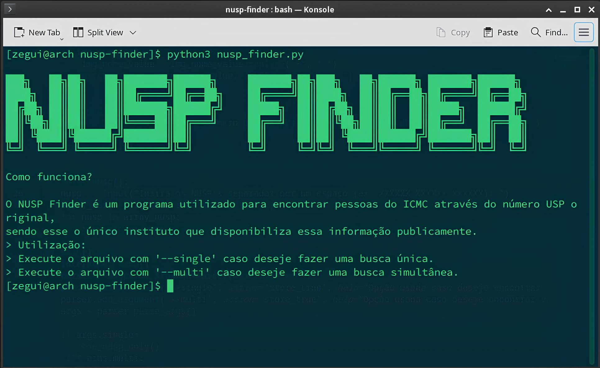

# NUSP Finder
A OSINT tool used for discovering the name of a person at ICMC using the USP ID number.


## Why developing it?

I don't really know, it's just a vaccation study.

## Next plans?

I will try to implement the application using threading/multithreading concepts and i wanna implement a option/function that saves the output in a external .txt file.

## Usage:

```
    use [zegui@arch ~]$ python3 nusp-finder.py --single to do a single search.
    use [zegui@arch ~]$ python3 nusp-finder.py --multi to do a multi search.
```

Feel free to open a Pull-Request or a Issue, give a star if you liked it.